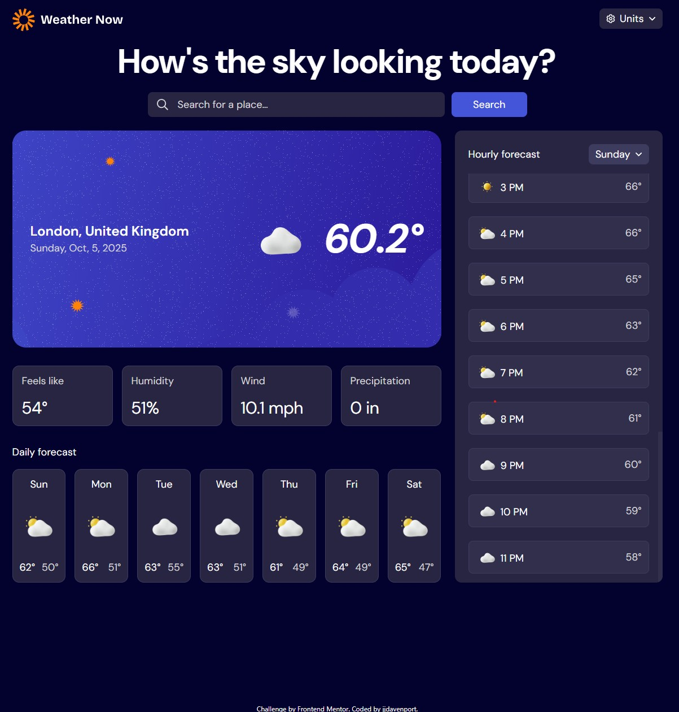

# Frontend Mentor - Weather app solution

This is my solution to the [Weather app challenge](https://www.frontendmentor.io/challenges/weather-app-K1FhddVm49) on Frontend Mentor.

## Table of contents

- [Overview](#overview)
  - [The challenge](#the-challenge)
  - [Screenshot](#screenshot)
  - [Links](#links)
- [My process](#my-process)
  - [Built with](#built-with)
  - [What I learned](#what-i-learned)
  - [Continued development](#continued-development)
  - [Useful resources](#useful-resources)
- [Author](#author)

## Overview

This is my entry to the Frontend Mentor 30 day Hackathon.

Challenge: [Challenge](https://www.frontendmentor.io/challenges/weather-app-K1FhddVm49)
Hackathon: [Hackathon](https://www.frontendmentor.io/articles/introducing-the-frontend-mentor-30-day-hackathon)

### The challenge

Users should be able to:

- Search for weather information by entering a location in the search bar
- View current weather conditions including temperature, weather icon, and location details
- See additional weather metrics like "feels like" temperature, humidity percentage, wind speed, and precipitation amounts
- Browse a 7-day weather forecast with daily high/low temperatures and weather icons
- View an hourly forecast showing temperature changes throughout the day
- Switch between different days of the week using the day selector in the hourly forecast section
- Toggle between Imperial and Metric measurement units via the units dropdown
- Switch between specific temperature units (Celsius and Fahrenheit) and measurement units for wind speed (km/h and mph) and precipitation (millimeters) via the units dropdown
- View the optimal layout for the interface depending on their device's screen size
- See hover and focus states for all interactive elements on the page

### Screenshot



### Links

- Solution URL: [Solution](https://www.frontendmentor.io/solutions/weather-app-fm30-hackathon-naXU4vQL1J)
- Repo URL: [Repo](https://github.com/jjdavenport/weather-app-main)
- Live Site URL: [Live site](https://jjdavenport.github.io/weather-app-main)

## My process

First step is too build the components and add necessary dependencies. Next I add the basic UI functionality which is basicly the drop down menus. Then its just a question of fetching from the open-meteo API and destructuring the data and mapping it on the various components. Then I added a function to fetch the users IP address this returns the
Longitude and latitude of the users IP which is stored in state and then the function to fetch with the open-meteo API is called with an effect giving the user a forecast as soon as the page loads. Finally I make a function to fetch a cities longitude and latitude with the Nominatim API when a user searches or uses the built in search list which is filtered onChange and is called with the onSubmit or onSelect props on the form or search list respectively.

### Built with

- Semantic HTML5 markup
- Flexbox
- CSS Grid for the daily list and desktop layout
- Mobile-first workflow
- [TypeScript](https://www.typescriptlang.org/) - Statically typed JavaScript
- [React](https://reactjs.org/) - JS library
- [tailwind css](https://tailwindcss.com/) - For styles
- [tailwind-scrollbar](https://github.com/adoxography/tailwind-scrollbar) - Hourly list scrollbar
- [lucide react](https://lucide.dev/) - Icons

### What I learned

How to handle default, loading and error states and chaining multiple async functions together for searching a specific city.
Learnt new methods to handle time and dates instead of using my own arrays of months and dates , I used built in methods to format the months and days. Extensive use of the useRef hook with my useClick custom hook with event listeners to see if a user clicked or tapped outside of the button area to close the various menus.

From:

```tsx
const months = [
  "Jan",
  "Feb",
  "March",
  "April",
  "May",
  "Jun",
  "July",
  "Aug",
  "Sep",
  "Oct",
  "Nov",
  "Dec",
];

const days = [
  "Sunday",
  "Monday",
  "Tuesday",
  "Wednesday",
  "Thursday",
  "Friday",
  "Saturday",
];

{
  `${days[new Date().getDay()]}, ${months[new Date().getMonth()]}, ${new Date().getDate()}, ${new Date().getFullYear()}`;
}
```

To:

```tsx
{
  `${new Date().toLocaleDateString("en-GB", { weekday: "long" })}, ${[new Date().toLocaleDateString("en-GB", { month: "short" })]}, ${new Date().getDate()}, ${new Date().getFullYear()}`;
}
```

### Continued development

After completion of this challenge, I'm planning on learning how to use Figma, so the ui matches the specification exactly, I also need to build some unit tests with Vitest.

### Useful resources

- [Tailwind scrollbar docs](https://adoxography.github.io/tailwind-scrollbar/) - These docs helped me configure tailwind scrollbar as I was unfamiliar with how to get it setup or if it was compatible with tailwind V4
- [Nominatim API docs](https://nominatim.org/release-docs/latest/api/Search/) - These page helped me configure my fetch request when you search for a city, the response provides city, county , longitude and latitude.

## Author

- Github - [jjdavenport](https://github.com/jjdavenport)
- Frontend Mentor - [@jjdavenport](https://www.frontendmentor.io/profile/jjdavenport)
